# Overview
**The project** is divided in two applications, the first one who receives the http post from the user interface is called **Proxy application** and the second one who process the bids and save them to the database is called **Cars application**. 

## The Proxy application

This application receives the http post requests and then **publishes** an **event** to the queue to be processed by the **Cars application**.

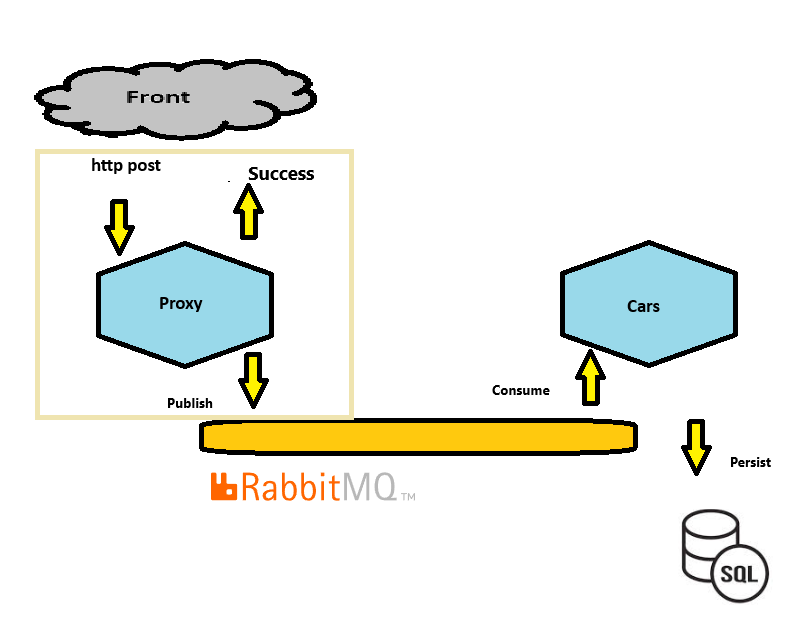

**For the case when it can't publish the event** it will retry (3 times retry), and if even after retry, the publish remains not possible, so the application will **save the event in a fallback** which is this case will be a local storage, so the events **can be re-published after**


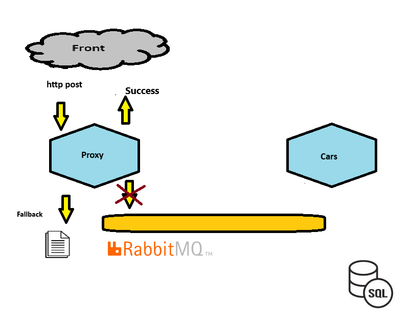

(we are using simple text files here to simplify the explanation but it can be any other way of persistence)  

in the file **Proxy.Core.Const.cs** you can configure your path

**I want to change it to a config settings as well as the database connection string
but it is only for demo.**

```csharp
 public const string FALLBACKPATH = "C:\\alvaro\\fallback";

```

**If fallback fails** so we need to tell the end user that the system could not process the request so we return a 500 status code to the end user.

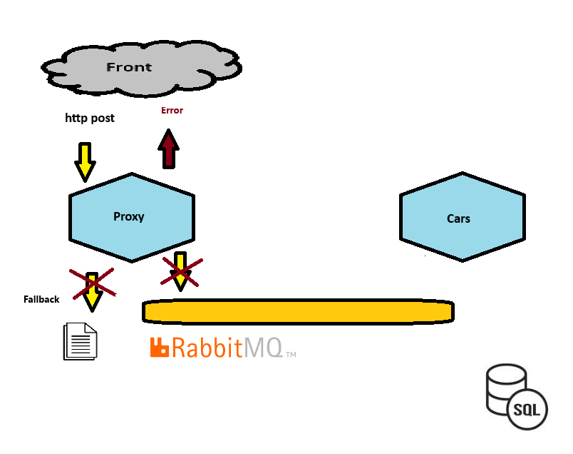


*Proxy application is made of two projects at alvaro.sln*

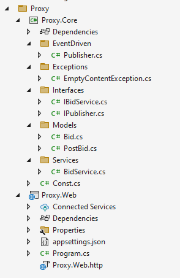

*Proxy.Web*

Responsible to receive the http post requests from the user interface and to manage dependency injection.

*Proxy.Core*

Responsible to publish the event and to make all the resilience handling.

## The Cars application

This application **consumes** an **event** from the queue and then process the **Bid** and then **save it to the database**.

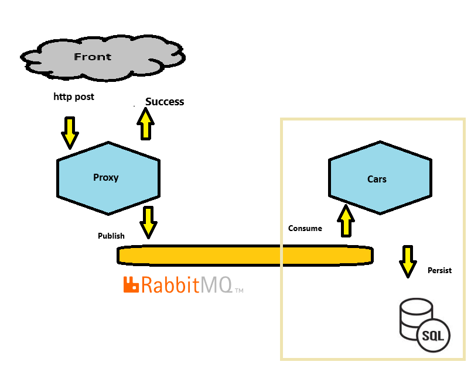


*if it can t save the bid in the database* there will be a *retry* at repository level.

(Default values of 6 for the maximum retry count and 30 seconds for the maximum default delay are used.)

But if even after retry the application can t save the bid in the database so it gives back the *event* to the queue in order to be processed again

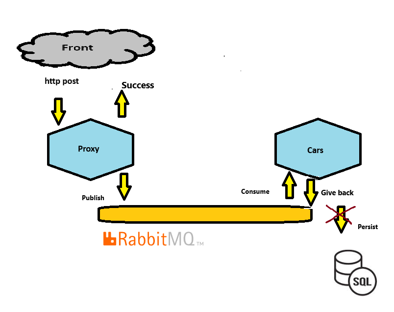


*Cars application is made of two projects at alvaro.sln*

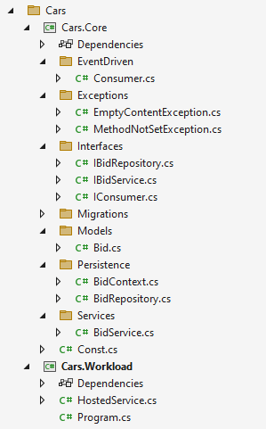


*Cars.Workload*

Responsible to run the workload and to manage dependency injection.

*Cars.Core*

Responsible to consume the event, process the bid and to save it in the database.


# Running the applications

## Run sql server container at docker
```
docker run --name sqlserver -e "MSSQL_SA_PASSWORD=LltF8Nx*yo" -e "ACCEPT_EULA=Y" -p 1433:1433 -d mcr.microsoft.com/mssql/server
```

### Creating the database

I ve used migrations to create the database schema.

https://learn.microsoft.com/en-us/ef/core/managing-schemas/migrations/?tabs=dotnet-core-cli


Go to the path ~\src\Cars.Core
and then run the *Migrations*
```
dotnet ef database update
```

## Run rabbitMQ container at docker
```
docker run --name rabbitmq -d -p 5672:5672 -p 15672:15672 -t rabbitmq:3-management
```

### Open the manager

open the following url at your browser http://localhost:15672/ and then create a new exchange called **myexchange**

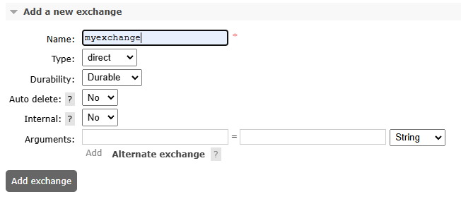

 and a queue called **bid** 

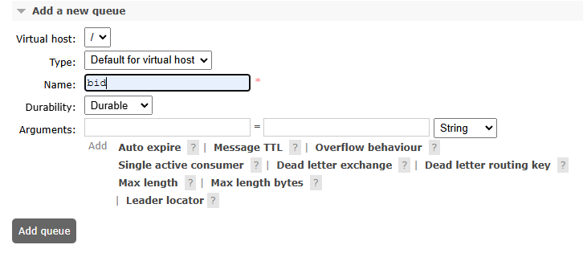

so you bind them together

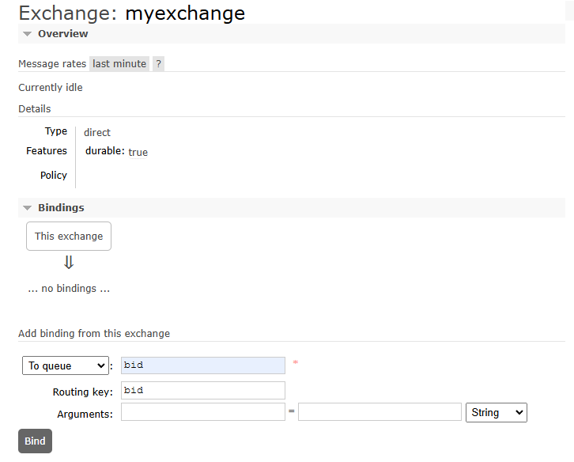

### Run your applications

In a terminal type **dotnet run**
in the following paths

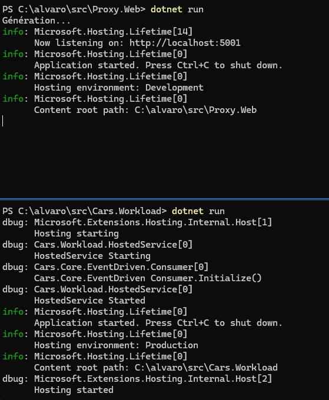

Now open the browser at http://localhost:5001/swagger/index.html and make a post

# Extras

### LoadTest

Go to the directory **loadtest** and then type

```
k6 run --vus 10 --duration 30s .\http.js
```
If you need to install it 

https://grafana.com/docs/k6/latest/get-started/running-k6/


### Database

To check out informations on the SQL Server database uses:

* User   :  sa
* Password:  LltF8Nx*yo

# Next Steps for this project

* Create unit tests
* Place config options like connection string and falback path in appsettings
* Add summary and comments to methods and classes
* Implement a way to re-send the messages from fallback folder


